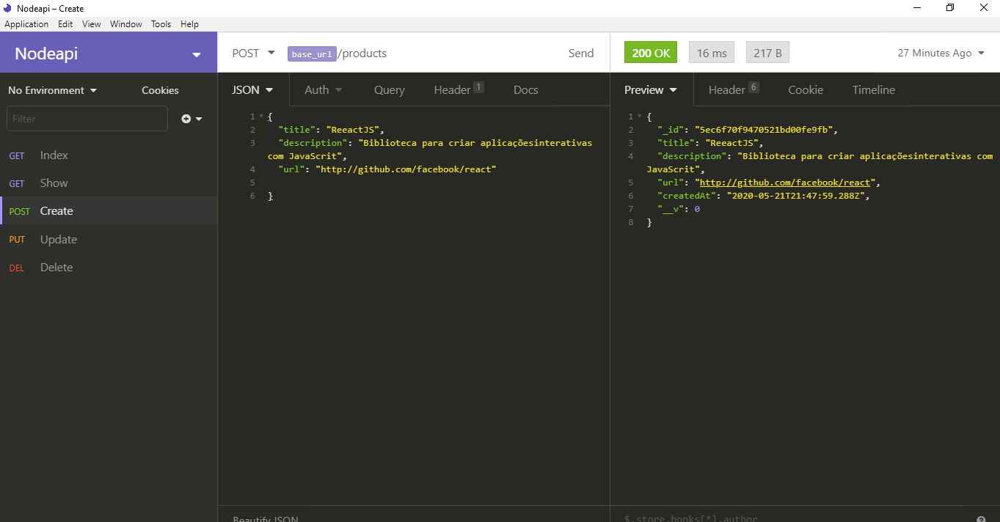
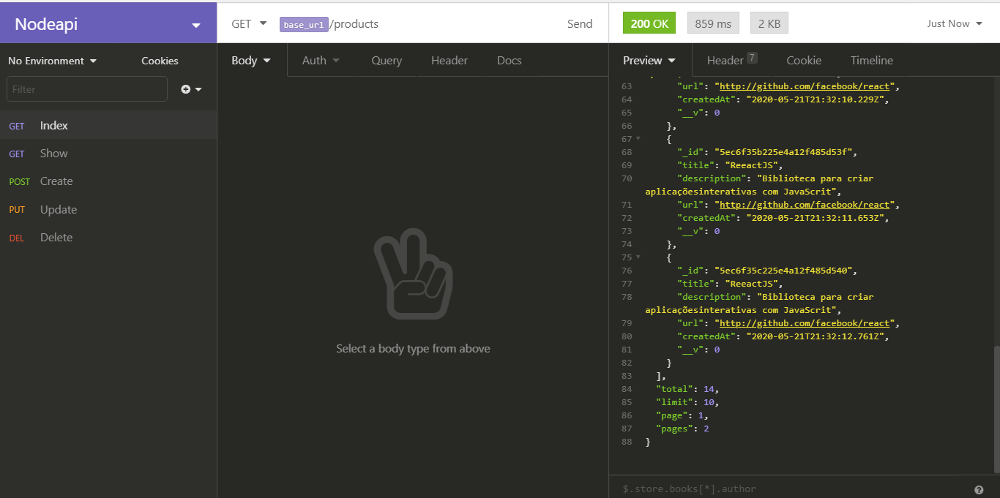

<h2>API-REST em Node</h2>

Foi desenvolvido um CRUD de um produto em Node, com o banco MongoDB.

<h3>Executar</h3>

clonar o projeto, na pasta do projeto executa yarn dev, tenha o mongodb e o execulte. com o Insomnia a Api pode ser manipulada na porta http://localhost:3001/api/ 

<h3>INSOMNIA</h3>

Insomnia foi utilizado para realizar as requisições

